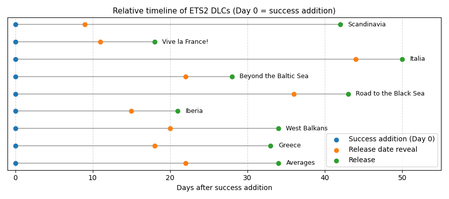
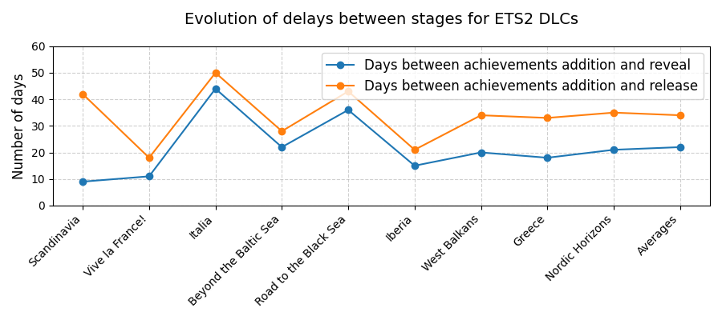

# scs-dlc-date-predictor
A small Python script that predicts the announcement and release dates of SCS Software DLCs (for American Truck Simulator and Euro Truck Simulator 2) based on when the related Steam achievements are added.

The prediction is calculated from historical data of previous DLCs, using average time intervals between:
- the addition of Steam achievements,
- the reveal date of the release date,
- and the actual release date.


## Example Output

In the console :

Nom du jeu (ets2/ats) : ets2 \
Nom du prochain DLC : Nordic Horizons \
Date d'ajout des succès (format JJ/MM/AAAA) : 23/10/2025 \
Moyenne délai succès - reveal : 22 \
Moyenne délai succès - sortie : 34

=== Estimation pour Nordic Horizons si les délais sont identiques à Greece === \
Ajout des succès : 23 October 2025 \
Reveal de la date de sortie estimée : 10 November 2025 \
Sortie estimée du DLC estimée : 25 November 2025 \
Sortie estimée du DLC (jeudi le plus proche) : 27 November 2025

=== Estimation pour Nordic Horizons avec les moyennes === \
Ajout des succès : 23 October 2025 \
Reveal de la date de sortie en moyenne : 14 November 2025 \
Sortie estimée du DLC en moyenne : 26 November 2025 \
Sortie estimée du DLC (jeudi le plus proche de la moyenne) : 27 November 2025

Charts generated : 




## Requirements

- **Python 3.8+**
- Libraries:
  - `matplotlib` (for chart display)
  - `statistics` *(standard library)*
  - `datetime` *(standard library)*

Install dependencies with:

```bash
pip install matplotlib
```

## Usage

1. Clone this repository:
    ```bash
    git clone https://github.com/lucasrecan/scs-dlc-date-predictor.git
    cd scs-dlc-date-predictor
    ```
2. Run the script
    ```bash
    python main.py
    ```
3. The script will print estimated dates in the console and open multiple charts comparing the timing of past DLCs.

*partie à adapter* 

## Notes

This project is **purely for fun** and based on empirical patterns from previous SCS DLC releases.  
It is **not affiliated with or endorsed by SCS Software**.


## License

This project is released under the **MIT License**.  
Feel free to reuse or modify the code.
